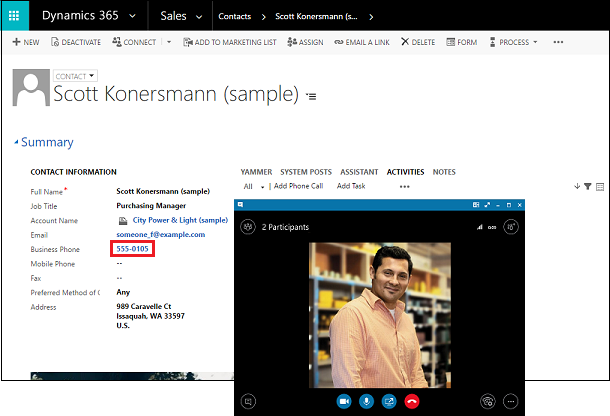
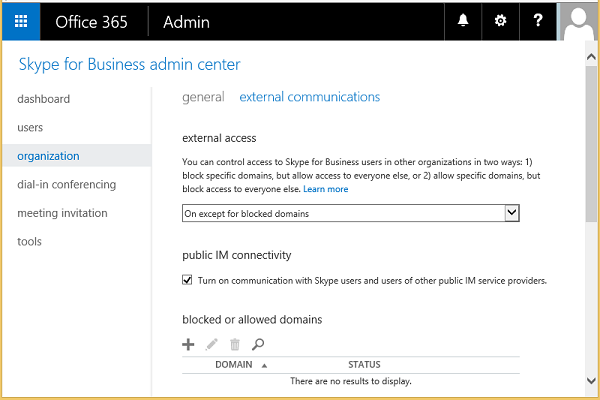
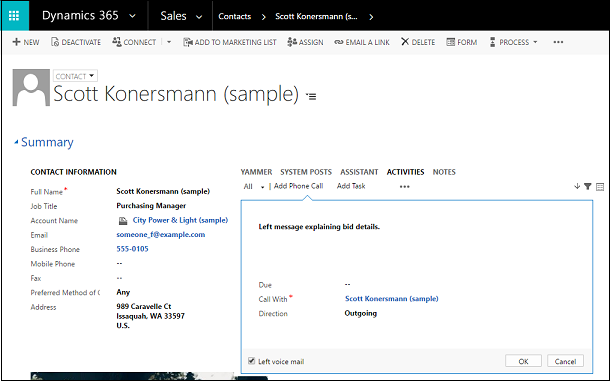

# Set up customer engagement apps to use Skype or Skype for Business

> [!Note]
> This feature was retired on July 31, 2021. More information: [Skype integration with customer engagement apps is deprecated](../important-changes-coming.md#skype-integration-with-customer-engagement-apps-is-deprecated)

When you use [!INCLUDE[pn_skype_for_business](../includes/pn-skype-for-business.md)] and customer engagement apps (Dynamics 365 Sales, Dynamics 365 Customer Service, Dynamics 365 Field Service, Dynamics 365 Marketing, and Dynamics 365 Project Service Automation), your organization can benefit from these capabilities:  
  
- Real-time communications with customers, colleagues, and team members without leaving customer engagement apps. Click or tap a person's phone number to call them.  
  
- Track meetings as Activities.  
  
- Get Presence information for members of the same email domain you are signed in with in [!INCLUDE[pn_skype_for_business](../includes/pn-skype-for-business.md)].  
  
    
  
## Set up Skype in customer engagement apps

1. In the Power Platform admin center, select an environment. 

2. Select **Settings** > **Product** > **Features**.  
  
4. Under Communications verify that **Skype presence** is set to **On** and **Set the telephony provider** is set to **Use Skype for Business**.
  
5. [!INCLUDE[proc_office365_signin](../includes/proc-office365-signin.md)]  
  
6. On the [!INCLUDE[pn_office_365_admin_center](../includes/pn-office-365-admin-center.md)] page, click or tap **Admin** > **Skype for Business** > **organization**.  
  
7. Choose the **general** tab. Review and set the presence privacy mode.  
  
   > [!NOTE]
   > Presence information is shown for members of the same email domain you are signed in to with [!INCLUDE[pn_skype_for_business](../includes/pn-skype-for-business.md)]. For example, if you are signed in with someone@contoso.com, you will see presence for other @contoso.com users.  
   > 
   > Instruct users to add the following as trusted sites in their browser:  
   > 
   > - https://*.dynamics.com  
   > - https://*.lync.com  
   > - https://*.sharepoint.com  
   > - https://login.microsoftonline.com  
  
8. Choose the **external communications** tab. Review and set the **external access** and public **IM connectivity** settings.  
  
     
  
## Tracking Skype  
 Now that [!INCLUDE[pn_skype](../includes/pn-skype.md)] is setup, your [!INCLUDE[pn_skype](../includes/pn-skype.md)] calls are tracked as activities.  
  
   
  
### See also 
 [Skype for Business and Skype integration](skype-business-integration.md)   
 [Skype for Business help](https://support.office.com/skype-for-business)

[!INCLUDE[footer-include](../includes/footer-banner.md)]
