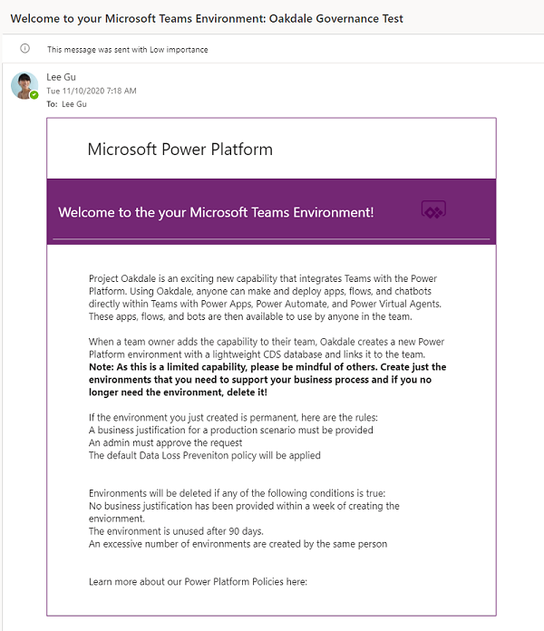
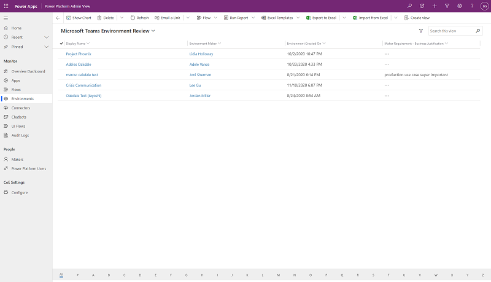
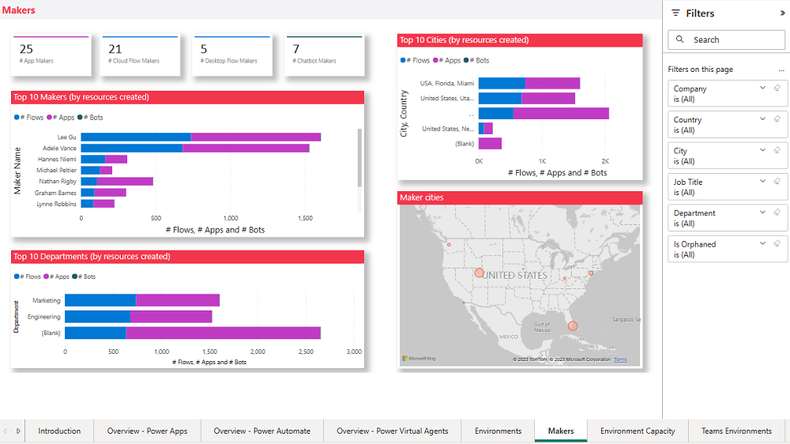

# Microsoft Dataverse for Teams environment management

You can take advantage of our philosophy of using Microsoft Power Platform to manage Microsoft Power Platform by building automation to send welcome emails to owners of new [Dataverse for Teams environments](../../admin/about-teams-environment.md) and requesting business justifications for newly created environments. This ensures that central IT teams can effectively engage with the new makers onboarding the platform, and ensure that Dataverse for Teams capacity is used effectively in your tenant and distributed to the most important business use cases. Similar workflows can be used to apply specific data loss prevention (DLP) policies to Dataverse for Teams environments as needed, and to invoke cleanup of unused assets to free up capacity for more compelling scenarios in the tenant.

> [!IMPORTANT]
> Automatically deleting an inactive Dataverse for Teams environment is now part of the Power Platform admin center. More information: [Automatic deletion of inactive Microsoft Dataverse for Teams environments](../../admin/inactive-teams-environment.md).

## Process description

**Problem statement:** Central IT wants to ensure that Dataverse for Teams environments are used effectively in their tenant. Central IT wants to understand the business justification for a Dataverse for Teams environment to be able to distribute capacity to the most effective business use cases.

**Solution:** Reactive governance and monitoring abilities are configured to provide team owners the ability to provide a business justification, and to provide central IT with the ability to approve or reject the business justification and run regular, automated cleanup flows.

## Business justification process

The following process is described from the point of view of the people involved and the components they interact with.

**Team owner:** The team owner gets a notification in Microsoft Teams to provide a business justification for the environment they've just created. Team owners have seven days to submit a business justification.

Team owners also receive a Welcome note via email to provide them with further information about their environment and the conditions for using it.

**Admin:** Microsoft Teams environments can be reviewed by using the **Microsoft Teams environment review** filter view in the **Power Platform Admin View** model-driven app.

An admin opens **Power Platform Admin View** > **Environments** > **Microsoft Teams environment review** and assesses all the environments due for review by looking at the **Audit** tab within the environment, investigating the justification submitted by the team owner, and then approving or rejecting the justification in the **Admin Review** section.

The admin can further decide to approve a business justification, but highlight it for later review by providing a review date.

## Monitoring and weekly cleanup process

> [!NOTE]
> Automatically deleting an inactive Dataverse for Teams environment is now part of the Power Platform admin center. More information: [Automatic deletion of inactive Microsoft Dataverse for Teams environments](../../admin/inactive-teams-environment.md)

Admins can also monitor inactive Microsoft Teams environments in their tenant and invoke cleanup as appropriate, in addition to having automated cleanup of unused environments in place to free up capacity for more compelling scenarios.

A weekly cleanup deletes environments that:

- Have been created more than seven days ago and have no business justification, or the business justification has been rejected by the admin.
- Have been created more than 90 days ago and have no apps or flows in the environment.

> [!NOTE]
> Currently, bots created by using Power Virtual Agents in Microsoft Teams environments aren't discoverable in the CoE Starter Kit.

An admin can customize the conditions for deletion by creating a copy of the flow and modifying it:

1. Go to [make.powerautomate](https://make.powerautomate.com) > **Solutions** > **Center of Excellence - Governance Components**.
1. Open the *Admin | Weekly Clean Up of Microsoft Teams environments* flow, and save a copy.
1. Modify the conditions used for marking environments for deletion, based on your business needs.

Team owners will receive a notification that their environment has been deleted.

In addition to the automatic cleanup, admins can also monitor how Microsoft Teams environments are used through a [Microsoft Teams environments](power-bi-monitor.md) report in the CoE Starter Kit dashboard.

The **Microsoft Teams environments** page shows you how many environments, environment makers, and apps and flows in Microsoft Teams environments you have. You can filter on the created date or creator name to drill down on trends and analyze them.

The page visualizes:

- The Microsoft Teams environment creation trend.
- The number of resources per environment.
- The list of environments, including the last launched date for an app in the environment.
- The list of apps in Microsoft Teams environments, including their last launched date.

### See also

[What is Dataverse for Teams?](/powerapps/teams/overview-data-platform)

[!INCLUDE[footer-include](../../includes/footer-banner.md)]
